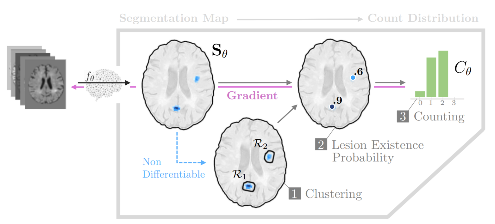

# Segmentation-Consistent Probabilistic Lesion Counting 
**(Under Review)**

<div style="text-align: justify">
Lesion counts are important indicators of disease severity, patient prognosis, and treatment efficacy, yet counting as a task in medical imaging is often overlooked in favor of segmentation. This work introduces a novel continuously differentiable function that maps lesion segmentation predictions to lesion count probability distributions in a consistent manner. The proposed end-to-end approach—which consists of voxel clustering, lesion-level voxel probability aggregation, and Poisson-binomial counting—is non-parametric and thus offers a robust and consistent way to augment lesion segmentation models with post hoc counting capabilities. Experiments on Gadolinium-enhancing lesion counting demonstrate that our method outputs accurate and well-calibrated count distributions that capture meaningful uncertainty information. They also reveal that our model is suitable for multi-task learning of lesion segmentation, is efficient in low data regimes, and is robust to adversarial attacks.
</div>




---
### Step-by-step tutorial (2D example)

A step-by-step guide (with minimal requirements) to compute the counting distibution and loss function from a 2D segmentation map can be found in the following notebook:


```
Counting_Example.ipynb 
```

### Counting Function

A ready to use implementation of the counting function for 3D data can be found in: 

```
count_function.py
```

An example of its use can be found in ```Counting_Example.ipynb```.


### Experiments

For reproducibility purposes, the full code for the experiment section will be release on *December 29th* (in agreement with the creators of the pipeline).


